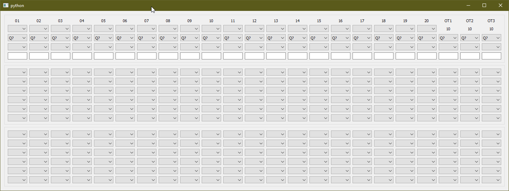

# BibleQuizScore
A New Scoring App for Bible Quiz

This scoring program is based on the Scoresheet that Daniel Meddaugh put out, and that I know a lot of coaches have been using for years (my coaches used it while I was a quizzer over 10 years ago). 

## Current Progress
Here is where you can see a picture of the current progress. 

## What's Better

* Ability to change quizzer in each seat
The excel sheet currently has you set the players in the first round, and your team can't change seats after that. I've been working around that by just putting all my quizzers down, and keeping track of who is sitting where myself, but that's not ideal (or maybe im lazy). This will have the stats tied to the quizzer, not to the seat. 

* mark interrupted questions
I've been putting (INT) in the front of my notes on the spreadsheet, but if I could mark a checkbox that notes it's been interrupted, that would be better, so i'm including it. 

* Ability to press a button to reset a given question in substitute situations.
Each question will have the ability to press a button to mark that a substitute question is being read, this allows for easy clearing of data already in that question, so you can get started right away at getting in the new information. 

* Collect stats across a season
Right now the spreadsheet collects stats across a meet. But this program will be able to collect stats across a season, and allow for you to keep old seasons

* Keyboard shortcuts
Interrupted question? Press 'i'!

* Didn't hear the point value? No problem!
Any question that doesn't have a point value yet will give you the option to simply mark "+" or "-". When you call a point of order for the point value, or get the point value when the quizmaster reads correct or incorrect, change the point value on the question, and the quizzer score will update accordingly. 

* No more spreadsheets.
I love spreadsheets, my android app for the Grant Horner Bible Reading System started as a google sheet. But they aren't ideal for mass use. And you have to lock down functionality. This will have the benefit of being a normal executable file. It will, however, have the ability to export to a spreadsheet. 

## Interested in helping? 
As you can see the codebase is in python, for more development info, [click here]("Dev Info")
